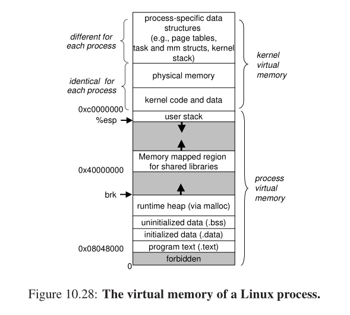
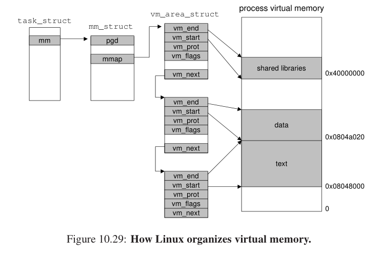
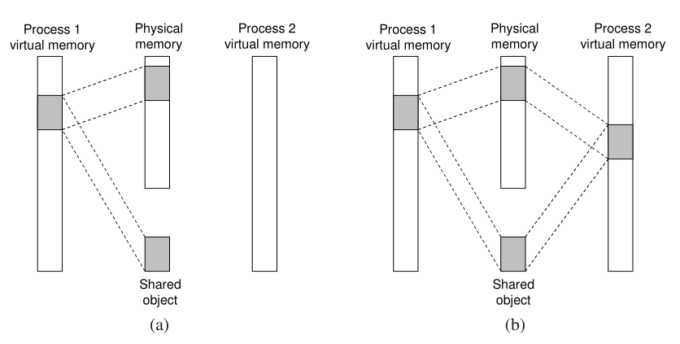
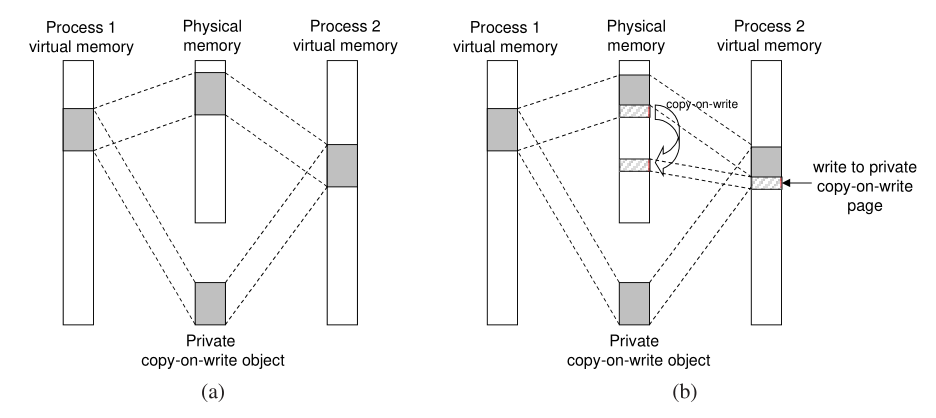
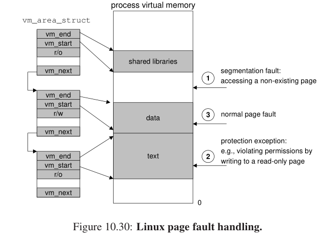
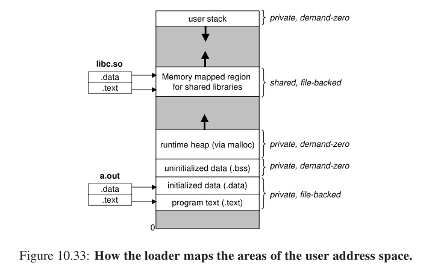

## 虚拟存储器

为了更加有效地管理存储器并且少出错，现代系统提供了一种对主存的抽象概念， 叫做**虚拟存储器(VM)**。虚拟存储器是硬件异常，硬件地址翻译， 主存，磁盘文件和内核软件的完美交互， 它为每个进程提供了一个大的， 一致的私有地址空间。 通过一个很清晰的机制，虚拟存储器提供了三个重要的能力：

1. 它将主存看成是一个存储在磁盘上的地址空间的高速缓存，在主存中只保留活动区域，并且根据需要在磁盘和主存之间来回传送数据，通过这种方式它高效的利用了主存。 
2. 它为每个进程提供了一致的地址空间，从而简化了存储器管理。 
3. 它保护了每个进程的地址空间不被其他进程破坏。 

早期的 PC 使用物理寻址，然而，现在处理器使用的是一种称为**虚拟寻址(virtual addressing)** 的寻址形式。 

CPU 通过生成一个**虚拟地址(Virtual Address, VA) 来访问主存， 这个虚拟地址在被送到存储器之前先转换成适当的物理地址。 将一个虚拟地址转换为物理地址的任务叫做**地址翻译(address translation)**。 就像异常处理一样， 地址翻译需要 CPU 硬件和操作系统之间的紧密合作。 CPU 芯片上叫做**存储器管理单元（Memory Management Unit, MMU）**的专用硬件，利用存放在主存中的查询表来动态翻译虚拟地址，该表的内容是由操作系统管理的。 

在一个带虚拟存储器的系统中，CPU 从一个有 N=2^n 个地址的地址空间中生成虚拟地址，这个地址空间称为虚拟地址空间（virtual address space）. 

地址空间的概念是很重要的，因为它清楚地区分了数据对象（字节）和他们的属性（地址）。一旦认识到了这种区别，那么我们就可以将其推广， 允许每个数据对象有多个独立的地址，其中每个地址都选自一个不同的地址空间。这就是虚拟存储器的基本思想。主存中的每个字节都有一个选自虚拟地址空间的虚拟地址和一个选自物理地址空间的物理地址。

操作系统软件， MMU（存储器管理单元）中的地址翻译硬件和一个存放在物理存储器中叫做**页表(page)**的数据结构， 页表将虚拟页映射到物理页。 每次地址翻译硬件将一个虚拟地址转换为物理地址时都会读取页表。 操作系统负责维护页表的内容， 以及在磁盘与 DRAM 之间来回传送页。 

虚拟存储器有三种状态： 1). 未分配的，没有任何数据和它们相关联，当然不占用任何磁盘空间。 2). 缓存的：当前缓存在物理存储器中的已分配页。 3). 未缓存的：没有缓存在物理存储器中的已分配页。 

在虚拟存储器的习惯说法中， DRAM缓存不命中称为**缺页(page fault).** 

现代操作系统使用的是按需调度方式。 

实际上，操作系统为每个进程提供了一个独立的页表， 因而也就是一个独立的虚拟地址空间。 多个虚拟页面可以映射到同一个共享物理页面上。 **按需调度和独立的虚拟地址空间的结合，对系统中存储器的使用和管理造成了深远的影响。 特别地， VM 简化了链接和加载， 代码和数据共享， 以及应用程序的存储器分配。 

- 简化链接
- 简化加载
- 简化共享
- 简化存储器分配

#### Linux 虚拟存储器系统
Linux 为每个进程维护了一个单独的虚拟地址空间。 

内核虚拟存储器包含内核中的代码和数据结构。 内核虚拟存储器的某些区域被映射到所有进程共享的物理页面。 例如，每个进程共享的物理页面。 例如，每个进程共享内核的代码和全局数据结构。 

内核虚拟存储器的其他区域包含每个进程都不相同的数据。 例如， 页表，内核在进程的上下文中执行代码时使用的栈，以及记录虚拟地址空间当前组织的各种数据结构。 

#### Linux 虚拟存储器区域
Linux 将虚拟存储器组织成一些区域（也叫做段）的集合。 一个区域(area)就是已经存在着的（已分配的）虚拟存储器的连续片(chunk)， 这些页是以某种方式相关联的。 例如， 代码段，数据段， 堆， 共享库段， 以及用户栈都是不同的区域。 每个存在的虚拟页面都保存在某个区域中，而不属于某个区域的虚拟页是不存在的， 并且不能被进程引用。 区域的概念很重要， 因为它允许虚拟地址空间有间隙。 内核不用记录那些不存在的虚拟页，而这样的页也不占用存储器，磁盘或者内核本身的任何额外资源。 

#### 进程中虚拟存储器区域的内核数据结构

#### 存储器映射
Linux(以及其他一些形式的 Unix)通过将一个虚拟存储器区域与一个磁盘上的对象（object）关联起来，以初始化这个虚拟存储器区域的内容，这个过程称为**存储器映射(memory mapping)**。 虚拟存储器区域可以映射到两种类型的对象中的一种。 
- Unix 文件系统中的普通文件： 一个区域可以映射到一个普通文件的连续部分， 例如一个可执行目标文件。文件区（section）被分成页大小的片，每个片包含一个虚拟页面的初始内容。因为是按需进行调度，所以这些虚拟页面没有实际交换进入物理存储器，直到 CPU 第一次引用到页面（即发射一个虚拟地址，落在地址空间这个页面范围之内）。 如果区域比文件区要大，那么就用零来填充这个区域的余下部分。 

- 匿名文件： 一个区域也可以映射到一个匿名文件， 匿名文件是由内核创建的，包含的是二进制零。 

无论在哪种情况下，一旦一个页面被初始化了，它就在一个由内核维护的专门的交换文件（swap file）之间换来换去。 交换文件也叫做交换空间（swap space）或者交换区域（swap area）. 需要意识到的很重要的一点是， 在任何时刻， 交换空间都限制着当前运行着的进程能够分配的虚拟页面总数。 

存储器映射共享图

缺页异常

加载可执行目标文件到存储器

#### 总结
虚拟存储器是对主存的一个抽象。 支持虚拟存储器的处理器通过使用一种叫做虚拟寻址的间接方式来引用主存。 处理器产生一个虚拟地址，在被发送到主存之前，这个地址被翻译成物理地址。从虚拟地址空间到物理地址空间的地址翻译要求硬件和软件紧密合作。 专门的硬件通过使用页表来翻译虚拟地址，而页表的内容是由虚拟地址提供的。 
虚拟存储器提供三个重要的功能。 第一，它在主存中自动缓存最近使用的存放磁盘上的虚拟地址空间的内容。虚拟存储器缓存中的块叫做页。 对磁盘上页的引用会触发缺页，缺页将控制转移到操作系统中的一个缺页处理程序。 缺页处理程序将页面从磁盘拷贝到主存缓存， 如果必要，将写回被驱逐的页。 第二，虚拟存储器简化了存储器管理， 进而又简化了链接， 在进程间共享数据， 进程的存储器分配以及程序的加载。 最后，虚拟存储器通过在每条页表条目中加入保护位，从而简化了存储器保护。 
地址翻译的过程必须和系统中所有硬件缓存的操作集成在一起。 大多数页表条目位于 L1 高速缓存中， 但是一个称为 TLB 的页表条目的片上高速缓存，通常会消除访问在 L1 上的页表条目开销。
现代系统通过将虚拟存储器片和磁盘上的文件片关联起来，以初始化虚拟存储器片，这个过程称为存储器映射。 存储器映射为共享数据，创建新的进程以及加载程序提供了一种高效的机制。 应用程序可以使用 mmap函数来手工地创建和删除虚拟地址空间的区域。 然而，大多数程序依赖于动态存储器分配器， 例如 malloc，它管理虚拟地址空间区域内一个称为堆的区域。 