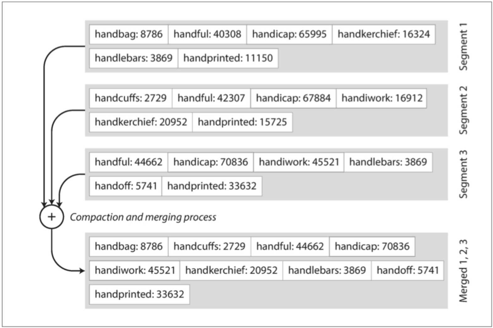
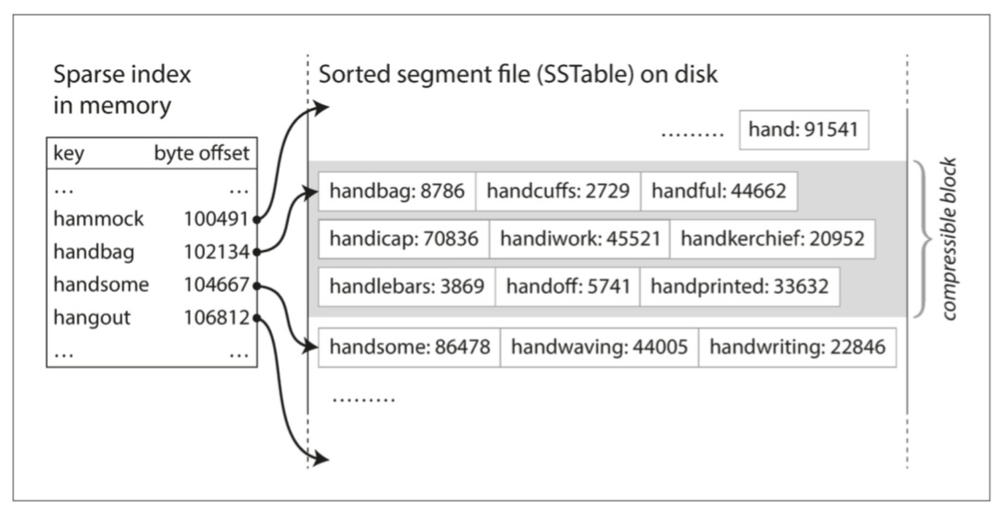

​       目前最常用的两种数据库无非是：**关系型数据库**和**NoSQL数据库**。 这两种数据库的存储引擎通常是：**日志结构存储引擎(log-structured storage engine)**例如：SSTables 和**面向页的存储引擎(page-oriented storage engine)**例如B树。

​        **SSTables(Sort String Table)** 是google的大数据三驾马车之一 — [《Bigtable: A Distributed Storage System for Structured Data》](https://static.googleusercontent.com/media/research.google.com/en//archive/bigtable-osdi06.pdf)中引入的词，其结构与Patrick O‘Neil等人发表的[LSM-Tree(Log-Structured)](https://www.cs.umb.edu/~poneil/lsmtree.pdf)类似。在LevelDB，Bitcask, Cassandra, Hbase, 甚至Lucene的关键词字典(term dictionary)中都得到了应用。

可以看做是对最常见的hash索引进行的扩展。 例如最简单的键值存储引擎可能是这样的: 

```shell
#!/bin/bash

db_set () {
	echo "$1,$2" >> database
}

db_get () {
	grep "^$1," database | sed -e "s/^$1,//" | tail -n 1
}
```

​        上面的几行代码实现了一个简单的键值数据库，数据写入是追加写，由于后面写入的值应该覆盖先前写入的值，因此读取是从后往前读的。 

​        由于上面的程序写入记录只是简单的往文件里追加一行记录，因此写入速度非常快；但是读取记录却需要从后往前顺序扫描文件，时间复杂度是O(N)。 当然，加快读取速度的方法也很简单，可以维护一份hash表。为了节约磁盘空间以及充分利用小磁盘空间，可以把上面的database文件分成一系列小文件，然后用一个后台进程去压缩数据记录(去除重复记录，只保存最新值)，并且只使用每个键的最新值构建hash索引。 但是**hash索引有一个致命的弱点: 无法提供范围查询。**


​        把上诉的一系列小文件按照键排序，就是SSTables。如下图所示: 




​      如图，我们把键值记录，分文件(分段)以只追加写的方式写入，上面的三个文件中。 然后有一个后台进程，以类似于归并排序的方式把数据合并(去除重复，去除删除的记录等)到下面的一个文件中。 SSTables这种方式有很多优势：

1. 存储数据分成若干段(可以认为分成各个不太大的文件)，可以充分利用小磁盘空间，减少磁盘碎片的浪费。 另外，各个段都是有序的，可以使用类似于归并排序的方式进行合并，这样即使是内存空间比较有限，仍旧可以有效的处理大段数据记录的合并(合并时，最新的数据记录覆盖陈旧的数据记录)。
2. 实时的变更可以写入一个内存中的数据结构(memtable)，通常以红黑树和平衡树实现，例如Google BigTable论文中就是用红黑树实现的memtable。在写入，memtable之前，需要追加一条操作日志到一个磁盘上的小文件中，以用于机器突然宕机时，用于恢复数据。当memtable的大小达到一定的阈值后，就可以把memtable里面的数据写入到一个SSTable段中了。于此同时，此时发生的变更操作可以写入一个新的memtable中。
3. 当查找记录时，从最近时间的数据记录开始查找，先检查memtable里的数据，然后读取最新的SStable 文件，直到读取到记录或者遍历完SSTable文件。为加快查找，而且这些合并后的SSTable 文件都是有序的，可以为这些合并后的SSTable文件建立范围索引(如下图)，内存索引键之间根据内存的大小和SSTables文件的整体大小，确定内存索引键之间的稀疏层度。 另外，我们还可以用布隆过滤(Bloom Filter)判断一条记录是否存在。例如我们要在下图中查询handoff的值，根据字母序我们知道handoff在索引handbag和handsome之间，即偏移量在102134 ~ 104667之间。 由于SStable文件也是有序的，我们可以二分查找进行检索，最终查找到handoff的值: 5741。但是对于不存在的值，我们需要同样花费类似的查询开销。对于一些不太严格的场景，可以使用一个bitmap做布隆过滤，节省查询不存在值的开销。                      
4. 由于SStables是有序的，因此可以有效的支持范围查询。 


